### Victor Núñez

Developer & data engineer. I build data pipelines, analytics dashboards and fullstack web apps.

**Stack:** TypeScript · Python · Go · SQL · React · Next.js · Astro · FastAPI · PostgreSQL · Docker

[Portfolio](https://sterlinking89.github.io/) · [LinkedIn](https://www.linkedin.com/in/victor-figueroa-ster/) · [X](https://x.com/SterlinkIng89) · [Steam](https://steamcommunity.com/id/Sterlinking/) · [Email](mailto:victor.nunez.figueroa@gmail.com) · [CV](https://sterlinking89.github.io/cv.pdf)

  
  
  
  
  

